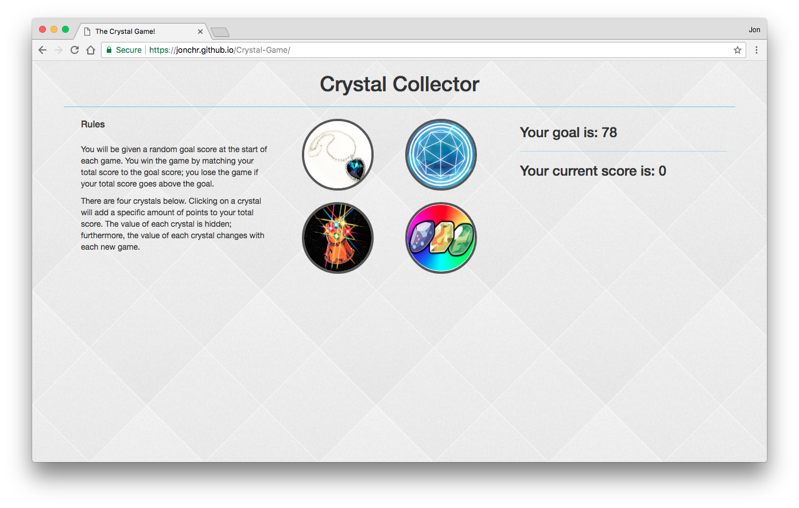
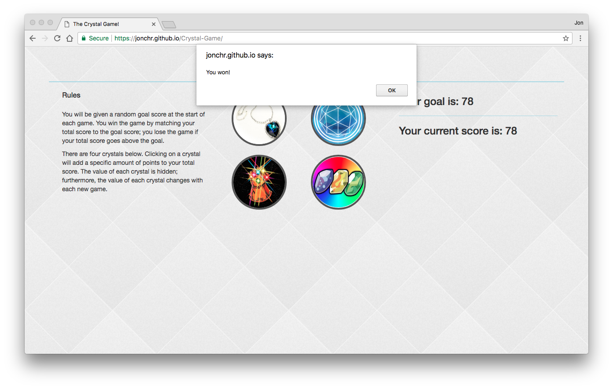
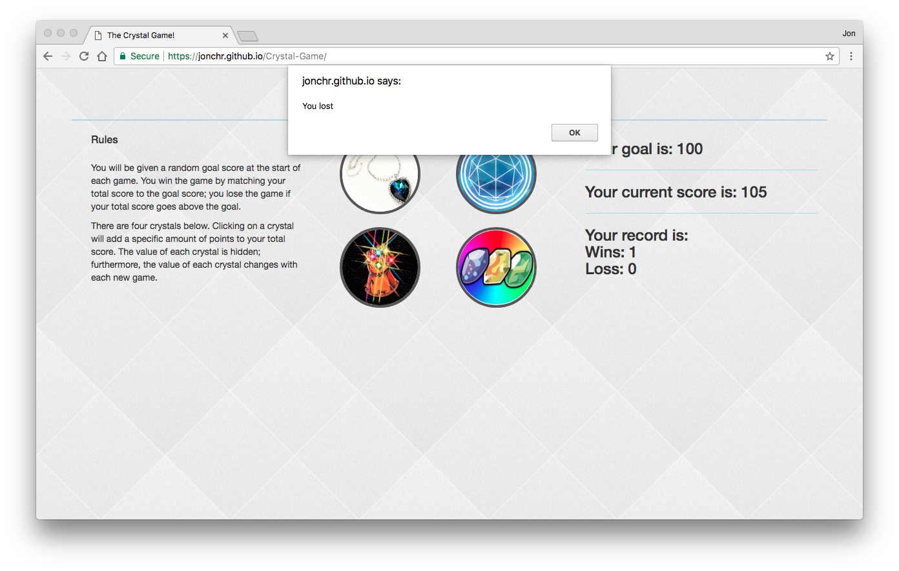

# Crystal-Game
An addition game demonstrating jQuery. This app creates a static webpage containing the game. A live version can be found at: https://jonchr.github.io/Crystal-Game/

## Description

The objective of this game is to get your score to exactly match the goal score by pressing the four crystals. Each of the four crystals will increase your score by an integer. The integer for each crystal is initially unknown to the player, various between 1 and 12, and changes with each game. The goal score ranges from 19 to 120, and also changes with each game. You lose if you increase your score above the goal score. Upon win or loss, the page will give an alert, and prepare the next game.

### Development

This game was developed as part of the GW Coding Bootcamp and was completed within end of the second week. This project was built using HTML5, CSS3 with Bootstrap 3.3.7, and Javascript with jQuery.

The four images for the crystals are all pop-culture references.
	Top Left - The Heart of the Ocean from **Titanic**
	Top Right - From the title card of British game show, **The Crystal Maze**
	Bottom Left - The Infinity Gaunlet from **Marvel Comics**
	Bottom Right - The Water, Fire, and Thunder Evolution stones from **Pokemon**
The random score for each crystal is stored as that HTML object's point's data-attribute.

The background image for this page is **Diamond Upholstery** and was used with permission from https://www.toptal.com/designers/subtlepatterns/diamond-upholstery/

### Organization

To run the game locally on your own computer, you can run the following in command line:

		git clone https://github.com/jonchr/Crystal-Game.git
		cd Crystal-Game
		open index.html

Upon cloning to your local machine, you can change the layout by editing index.html, the formatting in assets/css/style.css, or the functionality in assets/javascript/game.js.

## Screenshots
### The Crystal Game

### A sample victory screenshot

### A sample loss screenshot

